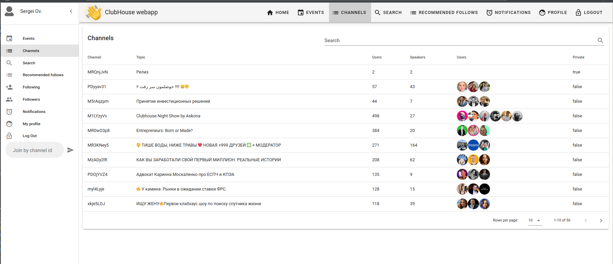
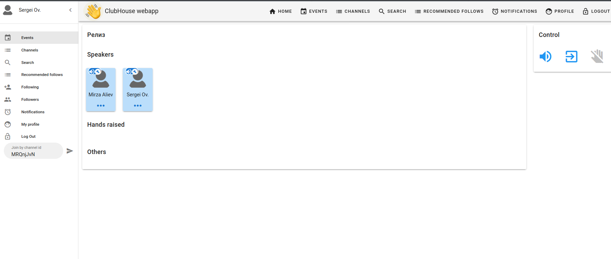
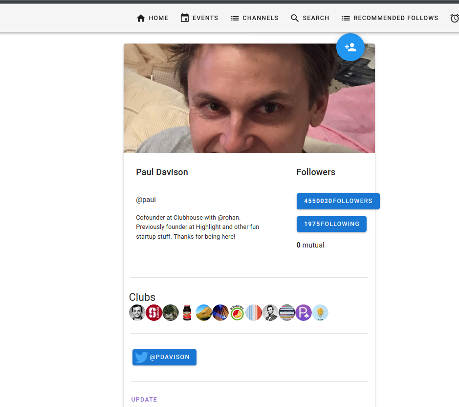

## Purpose of this web app

That's a personal project and not affiliated with any company.

This is the web client app to make your Club House experience better no matter what device you are using. Sometimes it's better to listen to podcasts on your PC. But CH team does not give such an opportunity for now so I decided to help someone who wants to use it besides mobile phones.It's for personal use only. I respect the job CH devs made so please use this app only as an addition to the mobile version.
 
It's for personal use only. I respect the job CH devs made so please use this app only as an addition to mobile version.
Also please note that there are not zero chances to be banned for using it (but if you'll register from iOS device it reduces the chances in multiple times).

Also please note that you can be logged in only from one device at the same time (the previous one will be logged out).

## Supported platforms (including speaking)
Windows, macOS, linux

## You need to register in iOS version to decrease the chances to be banned
That's why I don't implement registration finishing step in the app.
 Just find someone with iPhone and register yourself there 
 (don't forget to complete registration by typing username after you got your invite).

## Technologies used
* Spring boot (reactive), Java for backend part
* Vue, Vuex, Vuetify, Typescript for frontend part
* Node.js, react, electron for audio client for agora

## Supported features
* Authentication (warnings are displayed if you are in the wait list or not finished your registration)
* Events
* User suggestions
* Channel joining, speaking, hands rising, muting, making moderator, banning, speaker inviting/uninviting, hands raised list.
* Search
* User profiles, following
* Clubs profiles
* Followers and following users
* Notifications
* Channels recommended list
* Events recommended list

## To be done features  (PRs are welcome)

* User profile info updating (bio, avatar, instagram/twitter profiles)
* Room creation
* Topics exploration
* Pinging inside room
* Clubs subscription
* Inviting to CH

## How to install and use
There are 2 parts - first is backend for webapp installable via docker, and the second one is the local audio client (if you want to join channels) installed via normal setup.

**1.Install webapp**:

[Install docker](https://docs.docker.com/get-docker/) if not installed (windows, macOS, linux setup).

Create container inside docker (if you run it for the first time):

```docker run --restart=unless-stopped --name clubhouse -p 8080:8080 -d seovchinnikov/clubhouse-web:latest ```

And open http://localhost:8080/ in you browser. That's it (go to step 2)!
Flag -d runs container in the background, so you can close terminal after all. Flag --restart=unless-stopped restarts container after reboot of your PC (until you don't stop it manually). 

When you no longer needs the app - stop it:

```docker stop clubhouse```

And next time you want to resume it:

```docker start clubhouse```

Or (**alternatively**) you can download java 11, install it, open terminal/console and type:

```java -jar app.jar```

app.jar can be found in releases: https://github.com/seovchinnikov/clubhouse-web/releases

And open http://localhost:8080/ in you browser. That's it (go to step 2)!

**2.Install audio client**

If you want to join to channels and use audio features, you also need to setup audio connector on your local PC, prebuilt binaries are located in:
```agora-bridge/electron/prebuilds``` (or in https://github.com/seovchinnikov/clubhouse-web/releases)

There are binaries for Windows, MacOS; Linux is supported via wine (please look at ```agora-bridge/electron/prebuilds/linux_support.md```).

Just run the executables (dmg in case of macOS or exe inside zip build for windows)!
Note that audio client has to be run before you join the channel or you'll get error on joining.

When you'll finish your room participation and don't need audio speaking/listening anymore you can close audio client but don't forget to open it before you join the room again. 

--------------------------

**For developers only**:

**Web app**:

```mvn clean install -P dev```

This command will build web application under dev profile (Mock Server will be started to produce static 
json responses instead of sending requests to CH). And

```java -jar -Dspring.profiles.active=dev backend-service-0.0.1-SNAPSHOT.jar```

Will start app under dev profile.

**Audio client**:

Inside agora-bridge/electron:

```
npm install
npm run dist
```
Will build executables. And

```
npm run dev
```

Will start app in debug mode.

## Some screenshots







## WARNING

* ___FOR REFERENCE AND EDUCATION PURPOSES ONLY. THIS DOES NOT COME WITH ANY KINDS OF WARRANTY.___

* ___PLEASE DO NOT CREATE BOTS OR DO ANY HARMFUL THINGS TO THE SERVICE. DON'T BREAK THINGS. DON'T BE EVIL.___

* ___THIS PROJECT WILL DISCONTINUE DEVELOPMENT ONCE DEVELOPERS RELEASE AN WEB BUILD.___

## QnA

> Are you affiliated with  Clubhouse?

No. This is just my personal project.

> Why do we need a separate backend?

This is the proxy for Club House API. The main purpose of it is to validate incoming requests from user and make it as an adapter to CH backend.
Also we have Mock Server for dev purposes and for comfortable integration testing. 
The purpose of proxy backend can be further extended by proxying agora and pubnub requests.

> Why do you need another inner token (inner JWT)

It encapsulates all user-related token information in one place.

> Is it safe to login in this app?

The app communicates only with Club House server, AWS cloud where CH stores images, with Agora services as well as PubNub service.

The app stores user's CH tokens only as part of inner JWT token inside local storage of your browser. 
But because you deploy your own version of the app on localhost this data never leaves your computer (besides CH servers).

> Why don't you deploy and host the app?

I made this app for personal use and deploying it (besides your personal computer) elsewhere contradict with this idea.

> Why we need a separate audio client?

CH uses Agora for audio communications, and Agora supports two kind of clients - WebRTC in browsers and native clients. 
CH team banned support of WebRTC for their channels so we have to use native client and run it on windows, macOS, linux.
I've chosen electron sdk (but connected it via WebSockets so you can write other clients if you need to).
I'm using linux and Agora does not support native clients for linux but after many trials I've found a way to run this client on Ubuntu via wine.

> Where are the javadocs?

PRs are welcome.

### References
* https://github.com/stypr/clubhouse-py/ (Python build)
* https://github.com/Seia-Soto/clubhouse-api (NodeJS build)
* https://github.com/grishka/Houseclub (Android build)
* https://theori.io/research/korean/analyzing-clubhouse/ (Written in Korean)

## Thanks to
* @alievmirza
* @valeyko
* @stypr
* @Seia-Soto
* @grishka


## Contacts

seanovchinnikov@gmail.com
